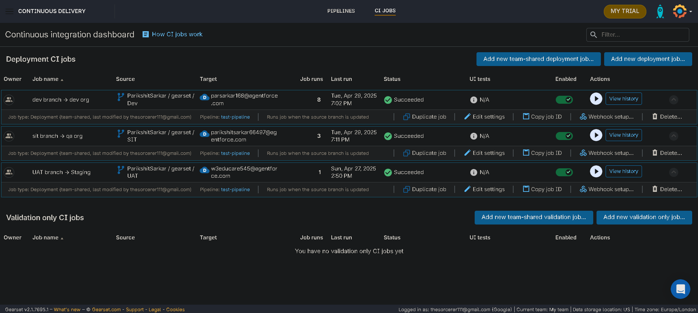
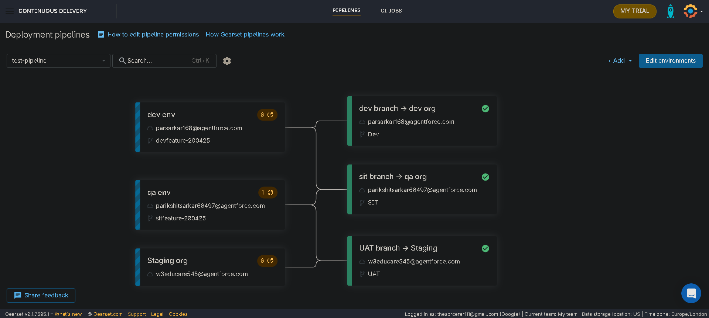

# How to set up a Salesforce DevOps process in Gearset

https://www.youtube.com/watch?v=4yGTHayQSdY&t=2038s

## Important Notes

Make sure you add the webhooks either automatically (preferred) or manually to your github repo, for both pipeline and CI jobs (there should be only one even if there are multiple CI jobs running in the pipeline).

## Sample CI Jobs

## Sample Pipeline

